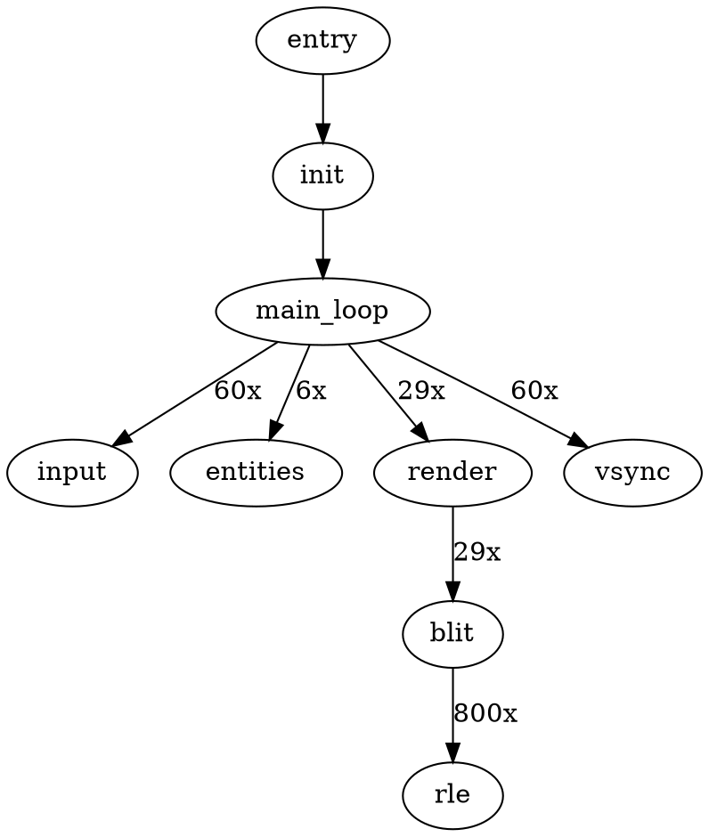

# 분석 기법

**작성일**: 2025-11-24
**기반**: Double Dragon DOS 프로젝트 (161개 함수 완전 분석)
**목적**: 검증된 분석 기법을 체계화하여, 다른 DOS 게임에서 재사용

---

## 📋 목차

1. [실행 경로 추적](#1-실행-경로-추적) ⭐ 가장 중요!
2. [호출 그래프 활용](#2-호출-그래프-활용)
3. [메모리 패턴 인식](#3-메모리-패턴-인식)
4. [Work Buffer 패턴](#4-work-buffer-패턴)
5. [점프 테이블 발견](#5-점프-테이블-발견)
6. [함수 포인터 추적](#6-함수-포인터-추적)
7. [압축 알고리즘 식별](#7-압축-알고리즘-식별)
8. [데이터 흐름 분석](#8-데이터-흐름-분석)
9. [역공학 체크리스트](#9-역공학-체크리스트)

---

## 1. 실행 경로 추적

### 🎯 핵심 개념

> **DOS 게임의 특징**: 단순한 선형 구조
>
> Entry Point → 초기화 → 메인 루프 → 종료

**왜 중요한가**:
- 전체 구조 파악 (Top-down)
- 맥락 이해 (각 함수의 역할)
- 의존성 파악 (순서 중요)

---

### 📍 Step 1: Entry Point 찾기

#### Ghidra에서 찾기
```
1. Symbol Tree 열기
2. "entry" 검색
3. 또는 "_start", "main" 검색
```

#### 수동으로 찾기 (EXE 헤더)
```
DOS EXE 헤더:
  Offset 0x14: IP (Instruction Pointer)
  Offset 0x16: CS (Code Segment)
  → Physical Address = CS:IP
```

#### Double Dragon 실제 사례
```
Entry Point: 1000:029a
  ↓
FUN_1000_029a:
  - DOS 환경 체크
  - 메모리 초기화
  - FUN_1000_0cd1() 호출
```

---

### 📍 Step 2: 초기화 함수 추적

#### 패턴 인식
```c
void entry() {
  check_dos_version();      // DOS 버전 체크
  setup_memory();           // 메모리 설정
  init_graphics();          // 그래픽 모드 ← 찾기!
  load_assets();            // 에셋 로딩
  init_game_state();        // 게임 상태
  main_loop();              // 메인 루프 ← 찾기!
}
```

#### 초기화 함수 특징
- **그래픽 모드 설정**: INT 10h, AH=00h
- **메모리 할당**: INT 21h, AH=48h
- **파일 열기**: INT 21h, AH=3Dh
- **점프 테이블 설정**: memcpy() 패턴

#### Double Dragon 실제 사례
```
FUN_1000_0cd1: 초기화
  ├─ INT 10h, AX=000Dh    → CGA 320×200 16색 설정
  ├─ memcpy(0x18c4, ...)  → 렌더링 테이블 설정
  ├─ FUN_1000_604e()      → LZW 초기화
  └─ FUN_1000_04a9()      → 메인 루프 진입
```

**찾는 방법**:
1. Entry point 디컴파일 보기
2. 함수 호출 따라가기 (Ctrl+Click in Ghidra)
3. INT 10h 찾기 (그래픽 모드 설정)
4. 첫 번째 while(1) 찾기 (메인 루프)

---

### 📍 Step 3: 메인 루프 발견

#### 메인 루프 패턴
```c
void main_loop() {
  while (1) {              // 무한 루프
    handle_input();        // 입력 처리
    update_game_state();   // 상태 업데이트
    render();              // 렌더링
    wait_vsync();          // VSync 대기

    if (quit_flag) break;  // 종료 체크
  }
}
```

#### 찾는 방법

**방법 1: Ghidra 디컴파일**
```c
// 이런 패턴 찾기:
while (true) { ... }
while (1) { ... }
for (;;) { ... }
```

**방법 2: 어셈블리 패턴**
```asm
label_loop:
  CALL function1
  CALL function2
  CALL function3
  JMP label_loop    ← 무조건 점프 = 무한 루프
```

**방법 3: 호출 그래프**
```
Spice86 ExecutionFlow.json:
  - 가장 많이 호출된 함수 = 메인 루프 안
```

#### Double Dragon 실제 사례
```
FUN_1000_04a9: 메인 루프
  while (1) {
    FUN_1000_1e60();    // 입력 처리
    FUN_1000_2711();    // 엔티티 업데이트 ← 호출 6회
    FUN_1000_48e0();    // 렌더링 ← 호출 29회
    FUN_1000_0604();    // VSync 대기
  }
```

**검증**:
- ✅ 무한 루프 확인
- ✅ 입력 함수 있음
- ✅ 렌더링 함수 있음
- ✅ 타이밍 함수 있음

---

### 📍 Step 4: 핵심 시스템 추적

#### 메인 루프에서 호출되는 함수들

```
메인 루프
  ├─ 입력 처리
  │   └─ 키보드/조이스틱 읽기
  │
  ├─ 게임 로직
  │   ├─ 엔티티 업데이트
  │   ├─ 물리 시뮬레이션
  │   ├─ 충돌 검사
  │   └─ AI 처리
  │
  ├─ 렌더링
  │   ├─ 배경 그리기
  │   ├─ 스프라이트 그리기
  │   └─ UI 그리기
  │
  └─ 타이밍
      └─ VSync 대기
```

#### 각 시스템 식별 방법

**입력 처리**:
- Port 0x60 (키보드) 또는 0x201 (조이스틱) 읽기
- INT 16h (키보드 BIOS)

**엔티티 업데이트**:
- 반복문 (for/while)
- 메모리 배열 접근 패턴
- 구조체 크기 일정 (24 bytes, 18 bytes 등)

**렌더링**:
- 0xB800 (VRAM) 쓰기
- Port 0x3DA (VSync) 읽기
- memcpy() 대량 호출

**물리/충돌**:
- 덧셈/뺄셈 많음 (위치 계산)
- 비교 연산 많음 (충돌 체크)
- 점프 테이블 (충돌 핸들러)

---

### 🔍 실행 경로 추적 실습

#### 예제: Double Dragon Entry Point

**Step 1: Entry Point**
```c
// FUN_1000_029a
undefined2 FUN_1000_029a(void) {
  // DOS 환경 체크
  if (dos_version < 3.0) {
    print_error("Requires DOS 3.0+");
    exit(1);
  }

  // 초기화 호출
  FUN_1000_0cd1();  ← 이 함수를 추적!

  return 0;
}
```

**Step 2: 초기화 함수 (FUN_1000_0cd1)**
```c
void FUN_1000_0cd1(void) {
  // 그래픽 모드 설정
  INT_10h(0x000D);  // CGA 320×200

  // 렌더링 테이블 설정
  if (graphics_mode == 1) {
    memcpy(0x18c4, mode1_table, size);  // EGA
  } else {
    memcpy(0x18c4, mode2_table, size);  // CGA
  }

  // 에셋 로딩
  load_compressed_assets();

  // 메인 루프 진입
  FUN_1000_04a9();  ← 이 함수를 추적!
}
```

**Step 3: 메인 루프 (FUN_1000_04a9)**
```c
void FUN_1000_04a9(void) {
  while (1) {
    // 입력
    input = FUN_1000_1e60();

    // 업데이트
    FUN_1000_2711();  ← 엔티티 시스템

    // 렌더링
    FUN_1000_48e0();  ← 렌더링 시스템

    // VSync
    FUN_1000_0604();

    if (quit) break;
  }
}
```

**Step 4: 엔티티 시스템 (FUN_1000_2711)**
```c
void FUN_1000_2711(void) {
  for (int i = 0; i < 7; i++) {
    entity_t* e = &entities[i];
    if (e->active) {
      update_entity(e);
      check_collision(e);
      update_animation(e);
    }
  }
}
```

**완성된 실행 경로**:
```
Entry (029a)
  ↓
Init (0cd1)
  ↓
Main Loop (04a9)
  ↓
├─ Input (1e60)
├─ Entities (2711)
│   ├─ Update
│   ├─ Collision
│   └─ Animation
├─ Render (48e0)
│   ├─ Background
│   ├─ Sprites
│   └─ UI
└─ VSync (0604)
```

---

### ✅ 체크리스트: 실행 경로 추적

- [ ] Entry point 찾음
- [ ] 초기화 함수 식별
  - [ ] 그래픽 모드 설정
  - [ ] 메모리 할당
  - [ ] 에셋 로딩
  - [ ] 점프 테이블 설정
- [ ] 메인 루프 발견
  - [ ] 무한 루프 확인
  - [ ] 입력 처리 확인
  - [ ] 렌더링 확인
  - [ ] 타이밍 확인
- [ ] 핵심 시스템 식별
  - [ ] 엔티티 시스템
  - [ ] 렌더링 시스템
  - [ ] 입력 시스템
  - [ ] 물리/충돌 시스템
- [ ] 실행 흐름도 작성

---

## 2. 호출 그래프 활용

### 🎯 핵심 개념

> **함수 중요도 = 호출 빈도**
>
> 자주 호출되는 함수 = 핵심 함수

---

### 📊 Spice86 실행 추적

#### Step 1: 실행 추적 생성
```bash
# Spice86 실행
./Spice86 DDMAIN.EXE --record-execution

# 게임 플레이 (1-2분)
# 종료

# ExecutionFlow.json 생성됨
```

#### Step 2: 호출 그래프 분석
```python
import json

# 호출 그래프 로드
with open('ExecutionFlow.json') as f:
    data = json.load(f)

# 호출 빈도 집계
call_count = {}
for call in data['calls']:
    addr = call['target']
    call_count[addr] = call_count.get(addr, 0) + 1

# 정렬
sorted_funcs = sorted(call_count.items(),
                      key=lambda x: x[1],
                      reverse=True)

# 상위 20개 출력
for addr, count in sorted_funcs[:20]:
    print(f"{addr:04X}: {count} calls")
```

#### Double Dragon 실제 데이터
```
주소   호출 횟수  의미
────────────────────────────────────
293e:  29회      메인 렌더링 디스패처!
2711:   6회      엔티티 시스템 핵심!
12c0:  11회      타일맵 디스패처!
0604:  60회      VSync 대기 (매 프레임)
48e0:  29회      렌더링 파이프라인
2865:  800회     RLE 압축 해제 (200×4)
```

**해석**:
- `0x293e`: 29회 = 메인 렌더링 (프레임당 1회)
- `0x2711`: 6회 = 엔티티 업데이트 (7개 슬롯)
- `0x2865`: 800회 = 스프라이트 압축 해제 (200줄×4평면)

---

### 📈 호출 그래프 시각화

#### Graphviz 다이어그램


#### 텍스트 트리
```
entry (1x)
  └─ init (1x)
      └─ main_loop (1x)
          ├─ input (60x)
          ├─ entities (6x)
          │   ├─ update (6x)
          │   └─ collision (6x)
          ├─ render (29x)
          │   └─ blit (29x)
          │       └─ rle (800x)
          └─ vsync (60x)
```

---

### 🔍 누락 함수 발견

#### 문제: Ghidra가 인식 못한 함수

**이유**:
- 함수 포인터로만 호출
- 점프 테이블 사용
- 동적 주소 계산

**해결**: 호출 그래프 + 자동 디컴파일

#### Phase 4.5 실제 사례

**발견 과정**:
```python
# 1. Ghidra에서 인식된 함수 목록
ghidra_funcs = [0x029a, 0x0cd1, 0x04a9, ...]  # 118개

# 2. Spice86 호출 그래프에서 추출
spice_funcs = [0x029a, 0x0cd1, 0x293e, ...]  # 133개

# 3. 차집합 = 누락 함수
missing = set(spice_funcs) - set(ghidra_funcs)
# → [0x293e, 0x28c0, 0x28ef, ...]  # 15개 발견!
```

**자동 복구**:
```python
for addr in missing:
    # Ghidra에서 함수 생성
    createFunction(addr)
    # 디컴파일
    decompile(addr)
```

**결과**: 5분 만에 15개 함수 복구

---

### ✅ 체크리스트: 호출 그래프 활용

- [ ] Spice86 실행 추적
- [ ] ExecutionFlow.json 생성
- [ ] 호출 빈도 분석
- [ ] 상위 20개 함수 식별
- [ ] 누락 함수 발견
- [ ] 자동 디컴파일
- [ ] 호출 그래프 시각화

---

## 3. 메모리 패턴 인식

### 🎯 핵심 개념

> **DOS 게임의 메모리 특징**: 고정 주소, 반복 패턴

---

### 🔍 배열 패턴

#### 특징
```c
// 엔티티 배열 (7개 × 24 bytes)
0x16c6: Entity 0 (24 bytes)
0x16de: Entity 1 (24 bytes)
0x16f6: Entity 2 (24 bytes)
...
```

**인식 방법**:
1. 일정 간격 접근 (stride)
2. 반복문 안에서 접근
3. 인덱스 계산 (i * size)

#### Ghidra에서 찾기
```c
// 이런 패턴:
for (i = 0; i < N; i++) {
  ptr = base_addr + i * stride;
  process(ptr);
}

// 또는:
ptr = 0x16c6;
while (ptr < 0x1756) {
  process(ptr);
  ptr += 24;
}
```

**Double Dragon 실제 사례**:
```c
// FUN_1000_2711
void update_entities() {
  int* ptr = (int*)0x16c6;
  for (int i = 0; i < 7; i++) {
    if (*ptr != 0) {  // active flag
      update_entity(ptr);
    }
    ptr += 12;  // 12 words = 24 bytes
  }
}
```

---

### 🔍 구조체 패턴

#### 특징
```c
struct Entity {
  uint16_t sprite_ptr;    // +0x00
  uint16_t x;             // +0x02
  uint16_t y;             // +0x04
  uint16_t health;        // +0x06
  uint16_t state;         // +0x08
  // ... (24 bytes total)
};
```

**인식 방법**:
1. 고정 오프셋 접근 (ptr+0, ptr+2, ptr+4)
2. 관련 필드 함께 사용
3. 크기 일정

#### Ghidra에서 찾기
```c
// 이런 패턴:
*(ptr + 0)  // 첫 번째 필드
*(ptr + 2)  // 두 번째 필드
*(ptr + 4)  // 세 번째 필드

// 함수 간 일관성:
void func1(int* entity) {
  x = *(entity + 1);  // X 좌표
  y = *(entity + 2);  // Y 좌표
}

void func2(int* entity) {
  x = *(entity + 1);  // 동일한 오프셋!
  y = *(entity + 2);  // 동일한 오프셋!
}
```

**구조체 정의 복원**:
```c
// 여러 함수 분석 후:
struct Entity {
  uint16_t sprite_ptr;     // +0 (모든 함수)
  uint16_t x;              // +2 (모든 함수)
  uint16_t y;              // +4 (모든 함수)
  uint16_t health;         // +6 (일부 함수)
  uint16_t state;          // +8 (일부 함수)
  uint16_t animation_id;   // +10 (일부 함수)
  // ...
};
```

---

### 🔍 점프 테이블 패턴

#### 특징
```c
// 함수 포인터 배열
0x18c4: [func1, func2, func3, ...]

// 디스패치
int index = calculate_index();
jump_table[index]();
```

**인식 방법**:
1. 연속된 주소 값
2. 모두 코드 영역
3. 간접 호출 (CALL [addr])

#### Ghidra에서 찾기
```asm
; 어셈블리 패턴:
MOV  BX, [index]
SHL  BX, 1          ; × 2 (word size)
CALL [0x18c4 + BX]  ; 간접 호출
```

```c
// 디컴파일 패턴:
(**(code **)(index * 2 + 0x18c4))();
```

**Double Dragon 실제 사례**:
```
0x18c4: 렌더링 점프 테이블 (30 entries)
  [0] = 0x48e4
  [1] = 0x81c6
  [2] = 0x822e
  ...

사용:
  FUN_1000_48e0() {
    index = get_render_mode();
    (*(0x18c4 + index * 2))();
  }
```

---

### 🔍 비트 플래그 패턴

#### 특징
```c
// 플래그 비트
flags = 0x0000;
flags |= 0x0001;   // 비트 0: 활성
flags |= 0x0004;   // 비트 2: 점프 중
flags &= ~0x0008;  // 비트 3: 공격 끝

if (flags & 0x0001) { ... }  // 활성 체크
```

**인식 방법**:
1. AND/OR 연산 많음
2. 2의 제곱 상수 (0x01, 0x02, 0x04, 0x08)
3. 비트 테스트 (TEST, AND)

#### Ghidra에서 찾기
```c
// 이런 패턴:
if ((flags & 0x01) != 0) { ... }
if ((flags & 0x02) == 0) { ... }

flags = flags | 0x04;
flags = flags & ~0x08;
```

---

### ✅ 체크리스트: 메모리 패턴 인식

- [ ] 배열 패턴 찾기
  - [ ] 일정 간격 접근
  - [ ] 반복문 확인
  - [ ] 배열 크기 결정
- [ ] 구조체 복원
  - [ ] 오프셋 일관성 확인
  - [ ] 필드 의미 추측
  - [ ] 구조체 크기 확인
- [ ] 점프 테이블 발견
  - [ ] 연속 주소 확인
  - [ ] 간접 호출 찾기
  - [ ] 테이블 크기 결정
- [ ] 비트 플래그 식별
  - [ ] AND/OR 연산 확인
  - [ ] 플래그 의미 추측

---

## 4. Work Buffer 패턴

### 🎯 핵심 개념

> **DOS 게임의 일반 패턴**: 복사 → 처리 → 되돌리기

**목적**:
- 원본 데이터 보호
- 원자성 보장 (중간 상태 노출 안 됨)
- 롤백 가능

---

### 📦 패턴 구조

```c
// 1. 원본 → Work Buffer
memcpy(work_buffer, original_data, size);

// 2. Work Buffer 처리
for (int i = 0; i < count; i++) {
  process(&work_buffer[i]);
}

// 3. Work Buffer → 원본 (또는 출력)
memcpy(original_data, work_buffer, size);
```

---

### 🔍 인식 방법

#### 특징
1. **두 번의 memcpy()**
   - 첫 번째: 원본 → 임시
   - 두 번째: 임시 → 원본

2. **고정 버퍼 주소**
   - Work buffer는 전역 변수
   - 주소 고정 (예: 0x168f, 0x3530)

3. **크기 동일**
   - 원본 배열과 work buffer 크기 같음

#### Ghidra에서 찾기
```c
// 패턴 1: 명시적 복사
void process_entities() {
  memcpy(0x168f, 0x16c6, 168);  // 7×24 = 168 bytes

  for (int i = 0; i < 7; i++) {
    update_entity(&buffer[i]);
  }

  memcpy(0x16c6, 0x168f, 168);
}

// 패턴 2: 포인터 스왑
void process_entities() {
  temp = entities;
  entities = work_buffer;

  for (...) { ... }

  entities = temp;
}
```

---

### 📊 Double Dragon 사례

#### 사례 1: 엔티티 시스템
```
원본:  0x16c6 (7 slots × 24 bytes = 168 bytes)
Work:  0x168f (168 bytes)

Process:
1. memcpy(0x168f, 0x16c6, 168)
2. for (i=0; i<7; i++) update()
3. memcpy(0x16c6, 0x168f, 168)
```

**이유**: AI 업데이트 중 충돌 검사가 일관된 데이터 필요

---

#### 사례 2: 프로젝타일 시스템
```
원본:  0x3542 (6 slots × 18 bytes = 108 bytes)
Work:  0x3530 (108 bytes)

Process:
1. memcpy(0x3530, 0x3542, 108)
2. for (i=0; i<6; i++) update_projectile()
3. memcpy(0x3542, 0x3530, 108)
```

---

#### 사례 3: 스프라이트 블리팅
```
Work Buffer: 0x3800-0x38A0 (160 bytes)

Process:
1. Decompress RLE → Plane 0 (40 bytes) @ 0x3800
2. Decompress RLE → Plane 1 (40 bytes) @ 0x3828
3. Decompress RLE → Plane 2 (40 bytes) @ 0x3850
4. Decompress RLE → Plane 3 (40 bytes) @ 0x3878
5. Interleave 4 planes → VRAM
```

**이유**: 4-평면 CGA 처리 중 임시 저장 필요

---

### ✅ 체크리스트: Work Buffer 패턴

- [ ] memcpy() 호출 찾기
- [ ] 원본 주소 식별
- [ ] Work buffer 주소 식별
- [ ] 크기 확인 (원본 = work?)
- [ ] 처리 로직 확인
- [ ] 역방향 복사 확인
- [ ] 목적 이해 (왜 필요?)

---

## 5. 점프 테이블 발견

### 🎯 핵심 개념

> **점프 테이블 = 함수 포인터 배열**
>
> 런타임에 함수 선택 (다형성 구현)

---

### 🔍 인식 방법

#### 특징
1. **연속된 주소 값**
   ```
   0x18c4: 48e4  ← 함수 주소
   0x18c6: 81c6  ← 함수 주소
   0x18c8: 822e  ← 함수 주소
   ...
   ```

2. **간접 호출**
   ```asm
   CALL [0x18c4 + BX]
   ```

3. **인덱스 계산**
   ```c
   index = calculate();
   table[index]();
   ```

---

### 📍 Step 1: 간접 호출 찾기

#### Ghidra 디컴파일
```c
// 이런 패턴 찾기:
(**(code **)(0x18c4 + index * 2))();

// 또는:
func_ptr = *(uint16_t*)(0x18c4 + index * 2);
(*func_ptr)();
```

#### 어셈블리
```asm
MOV  BX, [index]
SHL  BX, 1          ; × 2 (word size)
CALL [0x18c4 + BX]  ; 간접 호출 ← 찾기!
```

**검색 방법**:
1. Ghidra에서 `CALL []` 검색
2. 또는 디컴파일에서 `**(code **)` 검색

---

### 📍 Step 2: 테이블 주소 찾기

#### 메모리 덤프
```python
# Spice86 메모리 덤프에서
addr = 0x18c4
for i in range(20):
    value = read_word(addr + i * 2)
    print(f"[{i}] = 0x{value:04X}")
```

#### Ghidra Data Window
```
1. Window → Memory Bytes
2. 주소 입력: 18c4
3. Word 단위로 보기
4. 연속된 함수 주소 확인
```

---

### 📍 Step 3: 테이블 크기 결정

#### 방법 1: 패턴 끝 찾기
```
0x18c4: 48e4  ← 함수
0x18c6: 81c6  ← 함수
...
0x18e0: 591d  ← 함수
0x18e2: 0000  ← 끝! (null 또는 데이터)
```

#### 방법 2: 인덱스 범위 분석
```c
// 코드에서 인덱스 범위 확인
if (index >= 0 && index < 30) {  ← 테이블 크기 = 30
  table[index]();
}
```

#### 방법 3: 초기화 코드 찾기
```c
// 초기화 함수에서:
memcpy(0x18c4, source_table, 60);  // 60 bytes = 30 entries × 2
```

---

### 📍 Step 4: 엔트리 식별

#### 각 엔트리 함수 디컴파일
```python
table_addr = 0x18c4
for i in range(30):
    func_addr = read_word(table_addr + i * 2)
    print(f"[{i}] 0x{func_addr:04X}")

    # Ghidra에서 함수 생성 (없으면)
    if not is_function(func_addr):
        create_function(func_addr)

    # 디컴파일
    decompile(func_addr)
```

---

### 📊 Double Dragon 사례

#### 발견된 5개 점프 테이블

**1. AI 디스패처 (0x16ef)**
```
크기: 256 entries
용도: 엔티티 AI 상태 기계
엔트리: [idle, walk, attack, jump, ...]
```

**2. Collision 핸들러 (0x0e3f)**
```
크기: 256 entries
용도: 충돌 타입별 처리
엔트리: [player_enemy, player_item, ...]
```

**3. Rendering 디스패처 (0x18c4)**
```
크기: 30 entries (동적!)
용도: 렌더링 함수 선택
초기화: memcpy(0x18c4, mode1_table or mode2_table, 60)
특징: Mode 1 (EGA) vs Mode 2 (CGA)
```

**4. Physics 디스패처 (0x2264)**
```
크기: 128 entries
용도: 프로젝타일 물리
엔트리: [gravity, bounce, explode, ...]
```

**5. Hook 포인터 (0x18d2)**
```
크기: 1 entry (단일 포인터)
용도: Update/Render hook
값: func_ptr (동적 변경)
```

---

### 🛠️ 자동 발견 스크립트

```python
# dump_jump_table.py
def find_jump_tables(program):
    results = []

    # 1. 간접 호출 찾기
    for instr in program.getListing().getInstructions(True):
        if "CALL" in instr.getMnemonicString():
            if instr.getOpObjects(0)[0].isIndirect():
                table_addr = get_reference_address(instr)
                results.append(table_addr)

    # 2. 각 테이블 크기 결정
    for addr in results:
        size = determine_table_size(addr)
        print(f"Table at 0x{addr:04X}, size={size}")

        # 3. 엔트리 추출
        for i in range(size):
            func_addr = read_word(addr + i * 2)
            if is_valid_function(func_addr):
                create_function(func_addr)
                print(f"  [{i}] = 0x{func_addr:04X}")
```

---

### ✅ 체크리스트: 점프 테이블 발견

- [ ] 간접 호출 찾기 (`CALL []`)
- [ ] 테이블 주소 식별
- [ ] 테이블 크기 결정
  - [ ] 패턴 끝 찾기
  - [ ] 인덱스 범위 확인
  - [ ] 초기화 코드 확인
- [ ] 각 엔트리 디컴파일
- [ ] 테이블 용도 이해
- [ ] 동적 변경 확인 (초기화)

---

## 6. 함수 포인터 추적

### 🎯 핵심 개념

> **함수 포인터 = 동적 함수 호출**
>
> Ghidra가 자동 인식 못할 수 있음

---

### 🔍 패턴 인식

#### 패턴 1: 점프 테이블 (위에서 다룸)
```c
table[index]();
```

#### 패턴 2: 콜백
```c
void foreach(callback_t cb) {
  for (int i = 0; i < N; i++) {
    cb(&items[i]);
  }
}
```

#### 패턴 3: 상태 기계
```c
state_func_t current_state = idle_state;

void update() {
  current_state();  // 현재 상태 실행
}

void change_state(state_func_t new_state) {
  current_state = new_state;
}
```

---

### 📍 Ghidra에서 찾기

#### 디컴파일 패턴
```c
// 함수 포인터 호출:
(*func_ptr)();
(**ptr_to_ptr)();
(*(code *)addr)();
```

#### 어셈블리 패턴
```asm
; 간접 호출:
CALL BX
CALL [BX]
CALL [0x1234]

; 함수 주소 로드:
MOV  BX, func_addr
CALL BX
```

---

### 🛠️ 누락 함수 복구

#### 문제
```
Ghidra가 함수로 인식 안 함
 → 디컴파일 안 됨
 → 호출 그래프에 없음
```

#### 해결
```python
# 1. 함수 포인터 찾기
pointers = find_function_pointers(program)

# 2. 각 포인터가 가리키는 주소 추출
for ptr in pointers:
    addr = dereference(ptr)
    if is_code(addr):
        create_function(addr)  # 수동 생성
        decompile(addr)
```

#### Double Dragon 사례: Phase 4.6
```
0x18c4 점프 테이블에서:
  - 30 entries 발견
  - 9개가 Ghidra 미인식

자동 복구:
  for (i = 0; i < 30; i++) {
    addr = *(uint16_t*)(0x18c4 + i * 2);
    if (!is_function(addr)) {
      create_function(addr);  ← 수동 생성
    }
  }

결과: 5분 만에 9개 함수 복구
```

---

### ✅ 체크리스트: 함수 포인터 추적

- [ ] 간접 호출 찾기
- [ ] 함수 포인터 변수 식별
- [ ] 포인터가 가리키는 주소 추출
- [ ] 누락 함수 생성
- [ ] 디컴파일
- [ ] 호출 그래프 업데이트

---

## 7. 압축 알고리즘 식별

### 🎯 핵심 개념

> **DOS 게임의 특징**: 메모리/디스크 절약을 위한 압축

**일반적 압축**:
- **RLE**: Run-Length Encoding (스프라이트)
- **LZW**: Lempel-Ziv-Welch (에셋 파일)
- **Huffman**: 엔트로피 인코딩 (텍스트)

---

### 🔍 압축 함수 찾기

#### 특징
1. **파일 I/O 후 호출**
   ```c
   file = open("DATA.EG1");
   read(file, buffer, size);
   decompress(buffer, output);  ← 찾기!
   ```

2. **큰 버퍼 할당**
   ```c
   compressed_size = 1000;
   uncompressed_size = 5000;  ← 5배!
   ```

3. **루프 + 비트 연산**
   ```c
   while (input_pos < input_size) {
     byte = read_byte();
     if (byte & 0x80) { ... }  ← 플래그 체크
   }
   ```

---

### 🔍 RLE 압축 식별

#### 특징
```c
// RLE 패턴:
if (count < 0) {
  // Repeat run: 같은 바이트 반복
  value = read_byte();
  for (i = 0; i < -count; i++) {
    output[i] = value;
  }
} else {
  // Literal run: 그대로 복사
  for (i = 0; i < count; i++) {
    output[i] = read_byte();
  }
}
```

#### 인식 방법
1. **부호 비트 체크**: `if (byte < 0)` 또는 `if (byte & 0x80)`
2. **반복 vs 복사** 분기
3. **짧은 함수** (30-50줄)

#### Double Dragon 사례
```c
// FUN_1000_2865 (47 bytes)
void rle_decompress(byte* input, byte* output) {
  int remaining = 39;  // 40 bytes per scanline

  while (remaining >= 0) {
    byte control = *input++;

    if (control == 0x80) {
      continue;  // Skip marker
    }
    else if (control < 0) {  ← RLE repeat
      int count = 1 - control;
      byte value = *input++;
      memset(output, value, count);
      output += count;
      remaining -= count;
    }
    else {  ← Literal run
      int count = control + 1;
      memcpy(output, input, count);
      input += count;
      output += count;
      remaining -= count;
    }
  }
}
```

---

### 🔍 LZW 압축 식별

#### 특징
```c
// LZW 패턴:
dictionary[256] = {0x00, 0x01, ..., 0xFF};  // 초기 딕셔너리
next_code = 256;

while (code = read_code(input)) {
  if (code == CLEAR_CODE) {
    reset_dictionary();
  }
  else if (code < next_code) {
    output_string(dictionary[code]);
    add_to_dictionary(prev + first_char(code));
  }
  else {
    // 특수 케이스
  }
}
```

#### 인식 방법
1. **가변 비트 읽기**: 9→10→11→12 bits
2. **딕셔너리 관리**: 배열 or 트리
3. **특수 코드**: CLEAR (256), EOF (257)
4. **큰 함수** (100+ 줄)

#### Double Dragon 사례
```c
// FUN_1000_60d0 (주요 루프)
// FUN_1000_604e (초기화)
// FUN_1000_605b (딕셔너리 추가)
// FUN_1000_6091 (코드 읽기)

// 매직 넘버:
if (header[0] == 0x1F && header[1] == 0x9D) {
  // Unix compress 형식!
  decompress_lzw(data);
}
```

---

### 🔍 압축 포맷 역공학

#### Step 1: 샘플 데이터 수집
```
압축 파일: DATA.EG1 (1000 bytes)
해제 후:    (5000 bytes)
압축률:     5:1
```

#### Step 2: 헤더 분석
```
Offset 0x00: 1F 9D  ← 매직 넘버
Offset 0x02: 90     ← 플래그 (9-bit 시작)
Offset 0x03: ...    ← 압축 데이터
```

#### Step 3: 패턴 찾기
```python
# 압축 파일 16진수 덤프
hexdump -C DATA.EG1 | head -20

# 반복 패턴 찾기
00: FF FF FF FF  ← 4번 반복 = RLE?
10: 00 01 02 03  ← 순차 = Literal?
```

#### Step 4: 함수 추적
```
파일 읽기 → FUN_1000_5ff3() → 출력
                ↓
         FUN_1000_6091()  ← 코드 읽기
         FUN_1000_605b()  ← 딕셔너리
```

#### Step 5: 알고리즘 복원
```c
// 의사코드 작성
function decompress(input):
  initialize_dictionary()
  while not eof:
    code = read_variable_bits()
    if code == CLEAR:
      reset()
    else:
      output(dictionary[code])
      add_to_dictionary(prev + first_char)
```

#### Step 6: 검증
```c
// C로 구현
void my_decompress(byte* input, byte* output);

// 원본 파일로 테스트
my_decompress("DATA.EG1", "output.bin");

// 비교
diff output.bin expected_output.bin
// → 일치! 알고리즘 복원 성공
```

---

### ✅ 체크리스트: 압축 알고리즘 식별

- [ ] 압축 함수 찾기
  - [ ] 파일 I/O 후 호출
  - [ ] 큰 버퍼 할당
- [ ] 압축 타입 식별
  - [ ] RLE? (부호 비트 체크)
  - [ ] LZW? (가변 비트 + 딕셔너리)
  - [ ] Huffman? (비트 트리)
- [ ] 헤더 분석
  - [ ] 매직 넘버
  - [ ] 압축 플래그
- [ ] 샘플 데이터 수집
- [ ] 의사코드 작성
- [ ] C 구현
- [ ] 검증 (원본 파일 테스트)

---

## 8. 데이터 흐름 분석

### 🎯 핵심 개념

> **데이터 흐름 = 데이터가 프로그램을 통과하는 경로**

**추적 대상**:
- 전역 변수
- 함수 파라미터
- 반환 값
- 메모리 포인터

---

### 🔍 전역 변수 추적

#### Ghidra에서
```
1. 메모리 주소 클릭 (예: 0x16c6)
2. 마우스 우클릭 → "Find References to..."
3. 모든 접근 지점 표시
```

#### 분석
```
0x16c6 참조:
  - FUN_1000_2711: 읽기 (엔티티 업데이트)
  - FUN_1000_3c7e: 쓰기 (초기화)
  - FUN_1000_3e6d: 쓰기 (리스폰)

결론: 0x16c6 = 엔티티 배열
```

---

### 🔍 함수 파라미터 추적

#### x86 16-bit 호출 규약
```c
// __cdecl16near (Double Dragon 사용)
void func(int a, int b, int c);

// 어셈블리:
PUSH c    ; 스택에 역순으로
PUSH b
PUSH a
CALL func
ADD  SP, 6  ; 스택 정리 (caller)

// 함수 내부:
MOV  AX, [BP+4]  ; a
MOV  BX, [BP+6]  ; b
MOV  CX, [BP+8]  ; c
```

#### Ghidra 디컴파일
```c
// 자동 인식:
void func(int param_1, int param_2, int param_3);

// 수동 분석:
void func(int entity_index, int x, int y);
     ← 의미 있는 이름으로 변경
```

---

### 🔍 반환 값 추적

#### x86 16-bit 규약
```c
// 반환 값:
// - 8/16-bit: AX
// - 32-bit: DX:AX
// - 포인터: AX (segment는 DS)

uint16_t func() {
  return 0x1234;  // MOV AX, 0x1234
}

uint32_t func() {
  return 0x12345678;  // DX=0x1234, AX=0x5678
}
```

#### 사용 추적
```c
result = FUN_1000_3824();  // 거리 계산
if (result < 100) {        // 가까우면
  attack();                // 공격
}

// 결론: FUN_1000_3824 = 거리 계산 함수
```

---

### 🔍 포인터 체이닝

#### 패턴
```c
// 2단계 간접 참조:
ptr1 = *(uint16_t*)0x1695;  // 스프라이트 포인터
ptr2 = *(uint16_t*)ptr1;     // 첫 번째 프레임
data = *(uint8_t*)ptr2;      // 실제 픽셀 데이터
```

#### 추적
```
0x1695 → 0x19ac → 0x4567 → pixel_data

각 단계 분석:
1. 0x1695: 현재 애니메이션 포인터 (엔티티 필드)
2. 0x19ac: 애니메이션 시퀀스 (프레임 배열)
3. 0x4567: 스프라이트 데이터 (압축됨)
```

---

### ✅ 체크리스트: 데이터 흐름 분석

- [ ] 전역 변수 추적
  - [ ] 모든 참조 찾기
  - [ ] 읽기 vs 쓰기 구분
  - [ ] 변수 의미 추측
- [ ] 함수 파라미터 분석
  - [ ] 호출 규약 확인
  - [ ] 파라미터 개수
  - [ ] 파라미터 의미
- [ ] 반환 값 추적
  - [ ] 레지스터 확인 (AX)
  - [ ] 사용 패턴 분석
- [ ] 포인터 체이닝
  - [ ] 간접 참조 단계
  - [ ] 각 단계 의미

---

## 9. 역공학 체크리스트

### 📋 프로젝트 시작

- [ ] 바이너리 파일 수집
- [ ] Ghidra 프로젝트 생성
- [ ] 자동 분석 실행
- [ ] Spice86 실행 추적
- [ ] 문서 저장소 초기화

---

### 📋 초기 분석 (2시간)

#### Entry Point & 초기화
- [ ] Entry point 찾기
- [ ] DOS 버전 체크 확인
- [ ] 그래픽 모드 설정 찾기 (INT 10h)
- [ ] 메모리 할당 확인 (INT 21h, AH=48h)
- [ ] 점프 테이블 초기화 찾기
- [ ] 메인 루프 발견

#### 메인 루프
- [ ] 무한 루프 확인
- [ ] 입력 처리 함수 식별
- [ ] 업데이트 함수 식별
- [ ] 렌더링 함수 식별
- [ ] 타이밍 함수 식별 (VSync)

---

### 📋 호출 그래프 분석 (1시간)

- [ ] ExecutionFlow.json 생성
- [ ] 호출 빈도 분석
- [ ] 상위 20개 함수 식별
- [ ] 누락 함수 발견
- [ ] 자동 디컴파일

---

### 📋 메모리 패턴 (2시간)

#### 배열 패턴
- [ ] 엔티티 배열 찾기
- [ ] 프로젝타일 배열 찾기
- [ ] 배열 크기 확인
- [ ] 구조체 크기 확인

#### 점프 테이블
- [ ] AI 디스패처 찾기
- [ ] Collision 핸들러 찾기
- [ ] Rendering 디스패처 찾기
- [ ] 테이블 크기 확인
- [ ] 각 엔트리 디컴파일

---

### 📋 압축 시스템 (3시간)

- [ ] 압축 함수 찾기
- [ ] 압축 타입 식별 (RLE? LZW?)
- [ ] 헤더 분석 (매직 넘버)
- [ ] 알고리즘 역공학
- [ ] C 구현
- [ ] 검증

---

### 📋 시스템별 분석 (10시간)

- [ ] 렌더링 시스템 (3시간)
- [ ] 엔티티/AI 시스템 (2시간)
- [ ] 물리/충돌 시스템 (2시간)
- [ ] 입력/카메라 시스템 (1시간)
- [ ] 스테이지/게임 상태 (1시간)
- [ ] 하드웨어 I/O (1시간)

---

### 📋 문서화 (계속)

- [ ] 분석 즉시 문서 작성
- [ ] 시스템 다이어그램
- [ ] 메모리 맵 작성
- [ ] 알고리즘 의사코드
- [ ] 실행 흐름도

---

### 📋 검증

- [ ] 원본 실행 vs 이해 비교
- [ ] 에셋 추출 성공
- [ ] 알고리즘 재구현 성공
- [ ] 100% 함수 커버리지

---

## 💡 마스터 팁

### 🎯 효율성

1. **자동화 우선** (수동 대비 ~100배)
2. **호출 그래프 활용** (중요도 우선)
3. **즉시 문서화** (재분석 방지)
4. **80% 이해하고 다음** (완벽주의 지양)
5. **패턴 인식** (한 번 배우면 계속 적용)

### 🔍 분석 순서

1. Entry point (30분)
2. 초기화 (30분)
3. 메인 루프 (1시간)
4. 호출 그래프 (1시간)
5. 상위 20개 함수 (4시간)
6. 나머지 함수 (10시간)

**총 ~17시간** (72KB 게임 기준)

### 📚 참고

- [06_LESSONS_LEARNED.md](06_LESSONS_LEARNED.md) - 실수와 배운 점
- [01_PROCESS_OVERVIEW.md](01_PROCESS_OVERVIEW.md) - 전체 프로세스
- [02_TOOLS_AND_SETUP.md](02_TOOLS_AND_SETUP.md) - 도구 세팅

---

**작성자 노트**:
> 이 기법들은 Double Dragon DOS 프로젝트에서 실제로 사용하여 검증되었습니다. 161개 함수를 17시간 만에 완전 분석한 경험을 바탕으로 작성되었습니다.

**다음 프로젝트에 적용하세요!**

---

**관련 문서**:
- [06_LESSONS_LEARNED.md](06_LESSONS_LEARNED.md)
- [01_PROCESS_OVERVIEW.md](01_PROCESS_OVERVIEW.md)
- [../WORK_PRINCIPLES.md](../WORK_PRINCIPLES.md)
