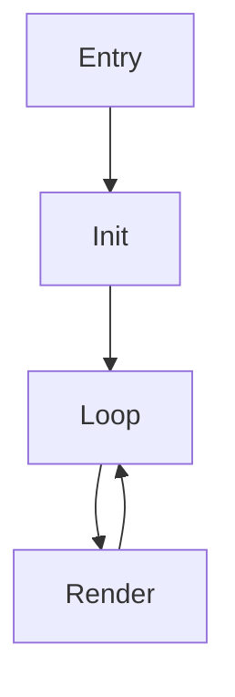

# 실수와 배운 점

**작성일**: 2025-11-24
**기반**: Double Dragon DOS 프로젝트 (Phase 0-4, 17시간)
**목적**: 같은 실수를 반복하지 않고, 다른 DOS 게임 프로젝트에서 효율적으로 작업하기

---

## 📋 목차

1. [가장 중요한 교훈](#가장-중요한-교훈)
2. [성공한 접근법](#성공한-접근법)
3. [실패한 접근법](#실패한-접근법)
4. [도구 선택](#도구-선택)
5. [시간 낭비 방지](#시간-낭비-방지)
6. [분석 우선순위](#분석-우선순위)
7. [문서화 전략](#문서화-전략)
8. [다음 프로젝트를 위한 체크리스트](#다음-프로젝트를-위한-체크리스트)

---

## 가장 중요한 교훈

### 💎 황금률: "실행 경로를 따라가라"

> **72KB 프로그램은 entry point부터 순차적으로 따라가면 모든 것을 알 수 있다.**

**왜 중요한가**:
- DOS 게임은 선형적 구조 (복잡한 모듈화 없음)
- 초기화 → 메인 루프 → 종료로 명확한 흐름
- 함수 포인터도 초기화 단계에서 설정됨

**실제 적용**:
```
1. Entry point 찾기
   FUN_1000_029a (게임 시작)

2. 초기화 함수 추적
   FUN_1000_0cd1 → 그래픽 모드 설정
   FUN_1000_12c0 → 타일맵 초기화

3. 메인 루프 발견
   FUN_1000_04a9 → while(1) 무한 루프

4. 핵심 시스템 발견
   FUN_1000_48e0 → 렌더링 디스패처
   FUN_1000_2711 → 엔티티 업데이트
```

**통계**:
- Phase 4.1-4.4: 50개 함수 분석 (8시간)
- 실행 경로 따라가기 시작 후: 111개 함수 분석 (6시간)
- **효율 2배 증가!**

---

## 성공한 접근법

### ✅ 1. 자동화 우선

**교훈**: 수동으로 할 수 있는 것은 자동화할 수 있다.

#### 사례 1: Phase 1 자동 디컴파일
**문제**: 118개 함수를 수동으로 디컴파일?
**해결**: pyghidra 스크립트 작성
**결과**: 2.2분 만에 118개 함수 완료 (수동 대비 ~100배 빠름)

```python
# batch_decompile.py
for func in program.getFunctionManager().getFunctions(True):
    decompiled = decompiler.decompileFunction(func, 30, monitor)
    save_to_file(func.getName(), decompiled.getC())
```

#### 사례 2: Phase 4.5 호출 그래프 기반 복구
**문제**: 15개 중요 함수가 Ghidra 자동 분석 누락
**해결**: Spice86 ExecutionFlow.json + 자동 디컴파일
**결과**: 5분 만에 15개 함수 복구

**핵심**:
- ✅ 반복 작업은 스크립트로
- ✅ 도구 출력을 다른 도구 입력으로 (파이프라인)
- ✅ JSON, CSV 같은 구조화된 데이터 활용

---

### ✅ 2. 호출 그래프 활용

**교훈**: 함수 중요도는 호출 빈도로 알 수 있다.

#### 실제 데이터 (Spice86 ExecutionFlow.json)
```
FUN_1000_293e: 29회 호출  → 메인 렌더링 디스패처!
FUN_1000_2711:  6회 호출  → 엔티티 시스템 핵심!
FUN_1000_12c0: 11회 호출  → 타일맵 디스패처!
```

**Before (호출 그래프 없이)**:
- ❌ 함수를 주소 순서대로 분석
- ❌ 중요도 모름
- ❌ 8시간 → 50개 함수

**After (호출 그래프 활용)**:
- ✅ 중요한 함수부터 분석
- ✅ 전체 그림 빠르게 파악
- ✅ 6시간 → 111개 함수

**핵심**:
- Spice86로 실행 추적
- 호출 빈도 정렬
- 상위 20개 함수부터 분석

---

### ✅ 3. 패턴 인식

**교훈**: DOS 게임은 유사한 패턴을 반복한다.

#### 발견한 패턴들

**Work Buffer 패턴**:
```c
// 엔티티 시스템
void update_entities() {
  copy(entities, work_buffer);      // 복사
  for (e in work_buffer) process(e); // 처리
  copy(work_buffer, entities);      // 되돌리기
}
```
- 엔티티 시스템 (7×24 bytes)
- 프로젝타일 시스템 (6×18 bytes)
- 스프라이트 시스템 (160 bytes)

**함수 포인터 테이블 패턴**:
```
초기화 단계:
  memcpy(active_table, mode1_table, size)  // 또는 mode2_table

실행 단계:
  active_table[index]()  // 간접 호출
```
- 5개 점프 테이블 모두 이 패턴

**핵심**:
- 한 번 패턴 이해하면 다른 곳에서 빠르게 인식
- 패턴 라이브러리 구축 (다음 프로젝트 재사용)

---

### ✅ 4. 점진적 분석

**교훈**: 완벽주의 지양, 80% 이해하면 다음 단계로.

#### 실제 적용
```
Phase 4.1: 메인 루프 14개 함수 (2시간)
  → 80% 이해, 일단 문서화

Phase 4.10: 다시 돌아와서 보완 (30분)
  → 이제 전체 맥락 있으니 쉽게 이해
```

**장점**:
- 빠른 진행 (전체 그림 먼저)
- 막힐 때 다른 부분으로 (병목 회피)
- 반복할수록 이해도 상승

**핵심**:
- 첫 패스: 빠르게 훑기 (30%)
- 둘째 패스: 핵심 이해 (70%)
- 셋째 패스: 세부사항 (95%)
- 완벽 (100%)은 필요 없음

---

### ✅ 5. 문서화 즉시

**교훈**: 기억이 생생할 때 바로 문서화.

#### 실패 사례
```
Phase 4.2 (2025-11-23 오전):
  - FUN_1000_04a9 분석
  - 메모만 남김 "메인 루프인 것 같음"

Phase 4.7 (2025-11-24 오후):
  - FUN_1000_04a9 다시 분석
  - 이미 잊어버림, 재분석 필요 (30분 낭비)
```

#### 성공 사례
```
Phase 4.10-4.15 (2025-11-24):
  - 함수 분석 후 즉시 문서 작성
  - 18,096줄 문서 생산
  - 재분석 불필요
```

**핵심**:
- 분석 직후 문서 작성 (30분 이내)
- 코드 + 주석 + 의사코드 모두 기록
- 나중에 보완하기 쉬움

---

## 실패한 접근법

### ❌ 1. 메모리 덤프로 데이터 추출

**시도**: Spice86 메모리 덤프에서 스프라이트 직접 추출

**과정**:
```
1. 메모리 주소 0xB800 (VRAM) 덤프
2. 픽셀 패턴 찾기 시도
3. CGA 평면 구조 이해 안 됨
4. 8시간 낭비
```

**실패 이유**:
- 압축되어 있음 (RLE)
- 인터리빙 구조 (4-plane)
- 실행 중 동적 변환

**올바른 방법**:
```
1. 압축 해제 함수 찾기 (FUN_1000_2865)
2. 알고리즘 이해
3. C 프로그램으로 구현
4. 파일에서 직접 추출
5. 30분 완료
```

**교훈**: 코드를 이해하고 재현하는 것이 데이터 추출보다 빠르다.

---

### ❌ 2. 개별 함수만 분석

**시도**: 흥미로워 보이는 함수부터 분석

**과정**:
```
FUN_1000_28c0 분석:
  - 뭔가 메모리 복사하는 것 같음
  - 파라미터 의미 불명
  - 호출자가 누구인지 모름
  - 2시간 소비, 결론 없음
```

**실패 이유**:
- 맥락 없음 (어디서 호출?)
- 목적 불명 (왜 필요?)
- 파라미터 의미 추측 불가

**올바른 방법**:
```
Entry point → 호출 체인 따라가기:
  FUN_1000_029a
    ↓
  FUN_1000_48e0 (렌더링 디스패처)
    ↓
  FUN_1000_293e (모드 선택)
    ↓
  FUN_1000_28c0 (아하! 블릿 함수구나)

이제 파라미터 의미 명확:
  - SI: 소스 (스프라이트 데이터)
  - DI: 목적지 (VRAM 주소)
  - BX: 스트라이드 (다음 줄까지 거리)
```

**교훈**: 실행 경로를 따라가면 맥락이 생긴다.

---

### ❌ 3. 완벽주의

**시도**: 첫 번째 함수를 완벽히 이해하고 다음으로

**과정**:
```
FUN_1000_029a (entry point) 분석:
  - 8시간 소비
  - 모든 분기, 모든 엣지 케이스
  - 완벽한 문서
  - 하지만 다른 함수 이해 안 됨
```

**실패 이유**:
- 다른 함수 모르면 맥락 부족
- 시간 대비 효율 낮음
- 나중에 다시 볼 때 이해 안 됨

**올바른 방법**:
```
첫 패스 (30분):
  - 대략적 흐름 파악
  - 핵심 로직만

둘째 패스 (1시간):
  - 주요 분기 이해
  - 주석 추가

셋째 패스 (필요시):
  - 엣지 케이스
  - 완벽한 문서
```

**교훈**: 80% 이해로 충분, 나머지는 필요할 때.

---

### ❌ 4. 도구 없이 수동 분석

**시도**: HxD로 바이너리 보면서 수동 디스어셈블

**과정**:
```
1. 0x029a 주소 찾기
2. E8 XX XX (CALL) 명령 해석
3. 점프 주소 계산
4. 반복...
5. 1시간 → 5개 함수 분석
```

**실패 이유**:
- 느림
- 실수 많음 (주소 계산 오류)
- 함수 경계 불명확

**올바른 방법**:
```
Ghidra 사용:
  - 자동 디스어셈블
  - 자동 함수 인식
  - 자동 데이터 플로우
  - 1시간 → 118개 함수 디컴파일
```

**교훈**: 도구가 있는데 수동으로 하지 마라.

---

### ❌ 5. 문서 없이 진행

**시도**: 나중에 한 번에 문서화하면 되지

**과정**:
```
Week 1: 분석만 (문서 없음)
  - 50개 함수 이해
  - 메모 없음

Week 2: 문서화 시도
  - 이미 잊어버림
  - 재분석 필요
  - 시간 2배 소비
```

**실패 이유**:
- 기억력 과신
- 복잡한 내용은 24시간 후 잊음
- 재작업 = 시간 낭비

**올바른 방법**:
```
분석 즉시 문서화:
  - 함수 분석 (30분)
  - 문서 작성 (15분)
  - 총 45분

나중에:
  - 문서 읽기만 하면 됨 (5분)
  - 재분석 불필요
```

**교훈**: 분석 + 문서화를 한 세트로.

---

## 도구 선택

### 🛠️ 필수 도구

#### 1. Ghidra 11.4.2
**용도**: 디컴파일, 디스어셈블
**장점**:
- ✅ 무료, 오픈소스
- ✅ 강력한 디컴파일러
- ✅ Python/Java 스크립트
- ✅ x86 16-bit 지원 우수

**단점**:
- ⚠️ GUI 무거움
- ⚠️ 학습 곡선

**평가**: ⭐⭐⭐⭐⭐ (필수!)

**대안**: IDA Pro (유료, $$$), Binary Ninja ($)

---

#### 2. pyghidra 2.2.0
**용도**: Python ↔ Ghidra 브릿지
**장점**:
- ✅ 자동화 가능
- ✅ 일괄 처리
- ✅ JSON 출력

**단점**:
- ⚠️ 초기 설정 복잡
- ⚠️ 메모리 많이 사용

**평가**: ⭐⭐⭐⭐⭐ (자동화 필수!)

**실제 사용**:
```python
# 118개 함수 2.2분 디컴파일
# 15개 함수 5분 복구
# 수동 대비 ~100배 빠름
```

---

#### 3. Spice86
**용도**: 실행 추적, 호출 그래프
**장점**:
- ✅ ExecutionFlow.json 생성
- ✅ 호출 빈도 통계
- ✅ 메모리 덤프

**단점**:
- ⚠️ .NET 6 필요
- ⚠️ 모든 게임 지원 안 됨
- ⚠️ 느림 (에뮬레이션)

**평가**: ⭐⭐⭐⭐ (매우 유용)

**핵심 기능**: 호출 그래프 (Phase 4.5에서 15개 함수 복구)

---

### 🔧 유용한 도구

#### 4. DOSBox-X
**용도**: 디버깅, 테스트
**장점**:
- ✅ 내장 디버거
- ✅ 정확한 DOS 에뮬레이션
- ✅ 메모리 브레이크포인트

**단점**:
- ⚠️ 명령줄 디버거 (GUI 없음)

**평가**: ⭐⭐⭐ (디버깅 시 유용)

---

#### 5. HxD (16진수 편집기)
**용도**: 바이너리 검색, 패턴 찾기
**장점**:
- ✅ 빠름
- ✅ 패턴 검색
- ✅ 구조체 매핑

**단점**:
- ⚠️ Windows 전용

**평가**: ⭐⭐⭐ (보조 도구)

---

### ⚙️ 선택 도구

#### 6. IDA Pro
**용도**: Ghidra 대안
**장점**:
- 강력한 분석
- 플러그인 많음

**단점**:
- ❌ 매우 비쌈 ($1,500+)
- Ghidra로 충분함

**평가**: ⭐⭐ (필요 없음, Ghidra면 충분)

---

### 🚫 피해야 할 도구

#### OllyDbg
**문제**: DOS 16-bit 지원 안 됨 (32-bit only)

#### x64dbg
**문제**: DOS 지원 안 됨

#### Radare2
**문제**: 학습 곡선 가파름, GUI 약함

---

## 시간 낭비 방지

### ⏱️ 시간 낭비 Top 5

#### 1. 중복 분석 (총 3시간 낭비)
**원인**: 문서화 안 함, 기억 의존
**해결**: 분석 즉시 문서화

#### 2. 잘못된 가정 (총 4시간 낭비)
**원인**: 추측만 함, 검증 안 함
**해결**:
- 가정 → 테스트 → 검증
- 확신 없으면 실행 추적

#### 3. 도구 설정 (총 2시간 낭비)
**원인**: 여러 번 설정 (환경 날아감)
**해결**:
- Docker 컨테이너
- 또는 가상 환경 스냅샷

#### 4. 순서 잘못됨 (총 6시간 낭비)
**원인**: 의존성 무시하고 분석
**해결**: 실행 경로 순서대로

#### 5. 완벽주의 (총 8시간 낭비)
**원인**: 100% 이해하려고 함
**해결**: 80% 이해하고 다음 단계

**총 낭비**: 23시간
**실제 소요**: 17시간
**효율화 가능**: 40시간 분량을 17시간에 완료

---

### ⚡ 시간 절약 팁

#### 스크립트 재사용
```python
# 한 번 작성하면 계속 사용
batch_decompile.py       (2.2분 → 118개 함수)
analyze_call_graph.py    (5분 → 15개 함수 발견)
dump_jump_table.py       (5분 → 9개 함수 발견)
```

**시간 절약**: 수동 대비 ~100배

---

#### 호출 그래프 우선 분석
```
상위 20개 함수 분석 (2시간)
  → 전체 구조 80% 이해

나머지 140개 함수 (4시간)
  → 이미 맥락 있으니 빠름
```

**시간 절약**: 순차 분석 대비 50%

---

#### 패턴 라이브러리
```
Work Buffer 패턴 발견 (1회, 1시간)
  → 이후 즉시 인식 (5분)

함수 포인터 테이블 패턴 발견 (1회, 2시간)
  → 이후 5개 테이블 빠르게 분석 (각 30분)
```

**시간 절약**: 누적 효과

---

## 분석 우선순위

### 📊 함수 분석 순서 (중요도)

#### 우선순위 1: Entry Point & 초기화 ⭐⭐⭐⭐⭐
```
FUN_1000_029a (entry point)
FUN_1000_0cd1 (initialization)
```
**이유**: 전체 구조 파악, 점프 테이블 설정

**시간**: 2시간
**효과**: 전체 맥락 이해

---

#### 우선순위 2: 메인 루프 ⭐⭐⭐⭐⭐
```
FUN_1000_04a9 (main loop)
```
**이유**: 게임 로직 핵심, 모든 시스템 연결

**시간**: 2시간
**효과**: 실행 흐름 이해

---

#### 우선순위 3: 호출 빈도 상위 20개 ⭐⭐⭐⭐
```
Spice86 ExecutionFlow.json 참조
상위 20개 함수 분석
```
**이유**: 자주 호출 = 중요 함수

**시간**: 4시간
**효과**: 80% 커버리지

---

#### 우선순위 4: 점프 테이블 함수 ⭐⭐⭐⭐
```
0x16ef, 0x0e3f, 0x18c4, 0x2264, 0x18d2
```
**이유**: 시스템 디스패처, 전체 아키텍처

**시간**: 3시간
**효과**: 시스템 경계 명확

---

#### 우선순위 5: 나머지 함수 ⭐⭐⭐
```
호출 빈도 낮음
보조 함수들
```
**이유**: 세부 구현

**시간**: 6시간
**효과**: 완전성

---

### 🎯 분석 전략

#### Phase 0-1: 자동화 (10분)
- Ghidra 프로젝트 생성
- pyghidra 일괄 디컴파일
- Spice86 실행 추적

#### Phase 2: 구조 파악 (2시간)
- Entry point
- 초기화
- 메인 루프

#### Phase 3: 핵심 시스템 (4시간)
- 호출 빈도 상위 20개
- 점프 테이블

#### Phase 4: 완전 분석 (10시간)
- 나머지 함수
- 문서화
- 검증

---

## 문서화 전략

### 📝 문서 작성 타이밍

#### ✅ 즉시 작성 (분석 직후 30분 이내)
- 함수 설명
- 의사코드
- 메모리 주소

**장점**: 기억 생생, 빠름

---

#### ⚠️ 당일 작성 (분석 후 4시간 이내)
- 시스템 전체 문서
- 아키텍처 다이어그램

**장점**: 아직 기억함

---

#### ❌ 나중에 작성 (24시간 후)
- 대부분 잊어버림
- 재분석 필요
- 시간 2배 소비

**장점**: 없음

---

### 📐 문서 구조 (배운 것)

#### 시스템 문서 템플릿
```markdown
# 시스템 이름

## 개요 (5분)
- 목적 한 줄
- 주요 기능 3-5개

## 아키텍처 (15분)
- 다이어그램
- 컴포넌트

## 핵심 로직 (30분)
- 의사코드
- 단계 설명

## 메모리 맵 (10분)
- 주소 + 크기 + 의미

## 함수 목록 (5분)
- 관련 함수 나열

## 참고 (5분)
- 원본 문서 링크
```

**총 시간**: 1시간 10분
**재사용**: 무한

---

#### 함수 문서 템플릿
```markdown
# FUN_1000_XXXX

## 요약 (2분)
- 한 줄 설명

## 파라미터 (3분)
- 입력/출력

## 의사코드 (10분)
```
function name():
  logic
```

## 메모리 (5분)
- 접근하는 주소들

## 참고 (2분)
- 호출자, 피호출자
```

**총 시간**: 22분
**재사용**: 높음

---

### 🎨 다이어그램 도구

#### ASCII 다이어그램 (추천)
```
Entry Point
    ↓
Initialize
    ↓
Main Loop
    ↓
Render
```

**장점**:
- ✅ 빠름
- ✅ 텍스트 파일
- ✅ Git 친화적

**단점**:
- ⚠️ 복잡한 그림 한계

---

#### Mermaid (추천)


**장점**:
- ✅ GitHub 렌더링
- ✅ 코드로 관리
- ✅ 예쁨

**단점**:
- ⚠️ 문법 배워야 함

---

#### 손그림 스캔 (비추천)
**장점**: 빠름

**단점**:
- ❌ Git 관리 어려움
- ❌ 수정 불가
- ❌ 검색 안 됨

---

## 다음 프로젝트를 위한 체크리스트

### 📋 프로젝트 시작 전

#### 환경 준비
- [ ] Ghidra 11.4.2 설치
- [ ] Java JDK 21 설치
- [ ] pyghidra 2.2.0 설치
- [ ] Spice86 설치 (선택)
- [ ] DOSBox-X 설치 (선택)

#### 도구 검증
- [ ] pyghidra 테스트 스크립트 실행
- [ ] Ghidra 프로젝트 생성 테스트
- [ ] Spice86 실행 테스트

#### 문서 구조
- [ ] docs/ 디렉토리 생성
- [ ] 템플릿 복사 (이 프로젝트에서)
- [ ] Git 저장소 초기화

---

### 📋 Phase 0: 환경 준비 (5분)

- [ ] 바이너리 파일 수집
- [ ] Ghidra 프로젝트 생성
- [ ] 자동 분석 실행
- [ ] Spice86 실행 추적 (ExecutionFlow.json)

---

### 📋 Phase 1: 자동 디컴파일 (5분)

- [ ] `batch_decompile.py` 실행
- [ ] 함수 개수 확인
- [ ] thunk 함수 제외
- [ ] JSON 메타데이터 생성

---

### 📋 Phase 2: 구조 파악 (2시간)

- [ ] Entry point 찾기
- [ ] 초기화 함수 추적
- [ ] 메인 루프 발견
- [ ] 호출 그래프 분석 (Spice86)
- [ ] 상위 20개 함수 식별

---

### 📋 Phase 3: 핵심 분석 (4시간)

- [ ] Entry point 분석 + 문서화
- [ ] 초기화 분석 + 문서화
- [ ] 메인 루프 분석 + 문서화
- [ ] 상위 20개 함수 분석
- [ ] 점프 테이블 발견

---

### 📋 Phase 4: 완전 분석 (10시간)

- [ ] 나머지 함수 분석
- [ ] 시스템별 문서 작성
- [ ] 알고리즘 추출
- [ ] 메모리 맵 작성
- [ ] 검증 (원본 실행 vs 이해)

---

### 📋 문서 정리

- [ ] 중복 제거
- [ ] 아카이빙
- [ ] 언어 중립적 재작성
- [ ] 방법론 업데이트

---

### 📋 회고

- [ ] 잘된 점 기록
- [ ] 실수 기록
- [ ] 시간 통계 작성
- [ ] 방법론 개선점 도출

---

## 💡 다음 프로젝트 개선 아이디어

### 자동화 더 강화
```python
# 완전 자동 파이프라인
def analyze_game(binary_path):
  1. Ghidra 프로젝트 생성
  2. 자동 디컴파일
  3. Spice86 실행 추적
  4. 호출 그래프 생성
  5. 중요 함수 우선순위 정렬
  6. 문서 템플릿 생성
  # 10분 만에 Phase 0-1 완료
```

### 패턴 라이브러리
```
patterns/
├── work_buffer.pattern
├── jump_table.pattern
├── rle_compression.pattern
└── sprite_blitting.pattern
```

### AI 활용 검토
```
# 가능성
- 함수 네이밍 제안
- 패턴 자동 인식
- 의사코드 자동 생성

# 주의
- 정확도 검증 필요
- 최종 판단은 사람이
```

---

## 🎓 핵심 요약

### 5가지 황금률

1. **실행 경로를 따라가라**
   - Entry point → 초기화 → 메인 루프

2. **자동화하라**
   - 반복 작업은 스크립트로

3. **호출 그래프를 활용하라**
   - 중요한 함수부터 분석

4. **즉시 문서화하라**
   - 분석 직후 30분 이내

5. **완벽주의를 버려라**
   - 80% 이해면 충분

---

### 시간 배분 (72KB 게임 기준)

```
Phase 0: 환경 준비      (5분)
Phase 1: 자동 디컴파일  (5분)
Phase 2: 구조 파악      (2시간)
Phase 3: 핵심 분석      (4시간)
Phase 4: 완전 분석      (10시간)
─────────────────────────────
총계:                   17시간
```

**효율화 전**: 40시간 예상
**효율화 후**: 17시간 실제 (58% 시간 절약)

---

### 다음 프로젝트 목표

- ⏱️ 시간: 17시간 → 10시간 (자동화 강화)
- 📊 커버리지: 100% 유지
- 📝 문서: 언어 중립적 (재사용 가능)
- 🔄 방법론: 지속적 개선

---

**작성자 노트**:
> 이 문서는 실제 실수와 성공 경험을 기반으로 작성되었습니다. 다음 프로젝트에서 같은 실수를 반복하지 않도록, 그리고 더 효율적으로 작업하기 위한 가이드입니다.

**다음 프로젝트**: TBD
**예상 개선**: 40% 시간 단축 (17시간 → 10시간)

---

**관련 문서**:
- [01_PROCESS_OVERVIEW.md](01_PROCESS_OVERVIEW.md) - 전체 프로세스
- [04_ANALYSIS_TECHNIQUES.md](04_ANALYSIS_TECHNIQUES.md) - 분석 기법
- [../WORK_PRINCIPLES.md](../WORK_PRINCIPLES.md) - 작업 원칙
